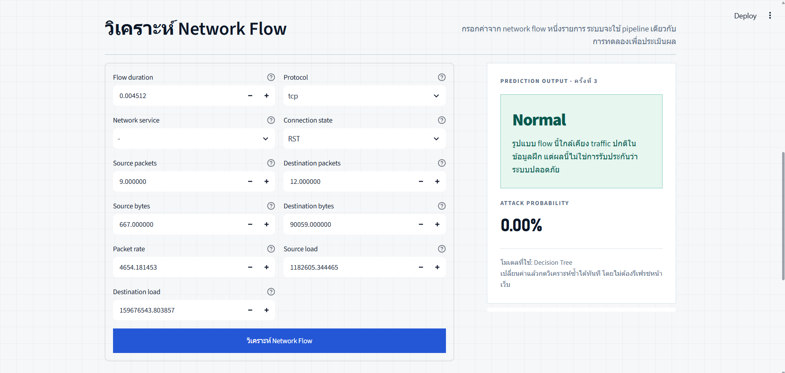

# UNSW-NB15 Network Intrusion Detection Web App

เว็บสาธิต Binary Classification สำหรับชุดข้อมูล UNSW-NB15 โดยโหลดโมเดล
scikit-learn ที่ฝึกเสร็จแล้วจาก Notebook และทำนาย `Normal` หรือ `Attack`



## โครงสร้างหน้าเว็บไซต์

- Hero อธิบายเป้าหมายโครงการและโมเดลที่กำลังใช้งาน
- Model evidence แสดง Accuracy, Precision, Recall และ F1-score
- Interactive demo รับข้อมูลพื้นฐาน 8 ค่า และคำนวณอีก 3 features อัตโนมัติ
- Prediction output แสดง Normal/Attack และ Attack probability
- How it works อธิบายเส้นทางตั้งแต่ input ถึงการตีความผล

หน้าเว็บออกแบบให้รองรับทั้งเดสก์ท็อปและมือถือ โดยใช้หน้าเดียวตามข้อกำหนด
Mini Project

## จุดสำคัญ

- App ไม่มีคำสั่ง `fit()` และไม่ฝึกโมเดลซ้ำ
- ลำดับและชนิดของ input มาจาก `feature_schema` ภายในโมเดล
- คำนวณ `rate`, `sload` และ `dload` จาก duration, packet และ byte โดยอัตโนมัติ
- แสดง Accuracy, Precision, Recall และ F1 จากผลการทดลองจริง
- รองรับ categorical feature ที่ไม่รู้จักผ่าน preprocessing pipeline เดิม
- อ่านชื่อโมเดล Run mode และ Metrics จาก artifact ที่ฝึกเสร็จแล้ว

## โครงสร้าง

```text
unsw_nb15_webapp/
├── app.py
├── model_runtime.py
├── requirements.txt
├── README.md
├── WORKLOG_TH.md
├── assets/
│   └── app-preview.png
├── .streamlit/
│   └── config.toml
├── artifacts/
│   └── best_model.joblib
└── tests/
    ├── test_app_smoke.py
    └── test_model_runtime.py
```

## รันบนเครื่อง

```bash
python -m venv .venv
python -m pip install -r requirements.txt
streamlit run app.py
```

## ทดสอบ

```bash
python -m unittest discover -s tests -v
```

## Deploy บน Streamlit Community Cloud

1. สร้าง GitHub repository ใหม่
2. อัปโหลดไฟล์ทั้งหมดในโฟลเดอร์นี้ โดยต้องมี
   `artifacts/best_model.joblib`
3. เปิด Streamlit Community Cloud และเลือก `Create app`
4. เลือก repository, branch และ entrypoint เป็น `app.py`
5. ใน Advanced settings เลือก Python ที่รองรับ dependency ใน
   `requirements.txt`
6. กด Deploy แล้วตรวจหน้า App และ log

## ข้อจำกัด

- โมเดลปัจจุบันมาจาก Full mode หลังลบข้อมูลซ้ำและคง official split
- Dataset UNSW-NB15 สร้างจาก traffic ปี 2015 จึงอาจไม่แทนภัยคุกคามใหม่
- Binary classification บอกเพียง Normal/Attack ไม่ระบุชนิดการโจมตี
- App รับค่าที่ผู้ใช้กรอก ไม่ได้เชื่อมต่อ packet capture หรือระบบเครือข่ายจริง
- Probability จาก Decision Tree อาจสุดโต่งตามสัดส่วนคลาสใน leaf

รายละเอียดการพัฒนาและเหตุผลของแต่ละการตัดสินใจอยู่ใน
[`WORKLOG_TH.md`](WORKLOG_TH.md)
